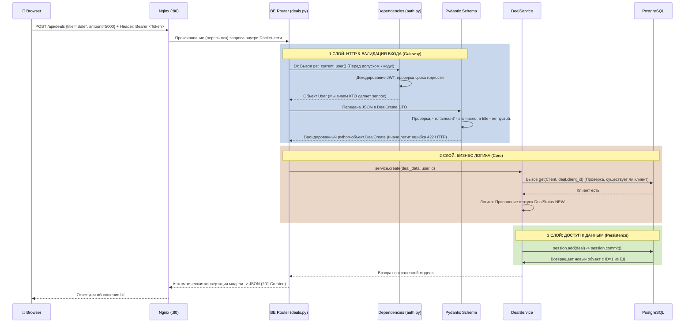
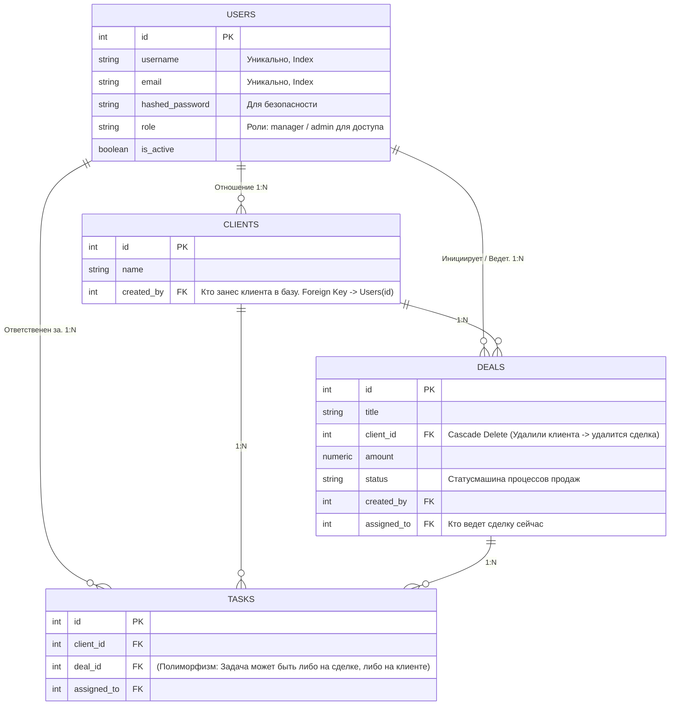
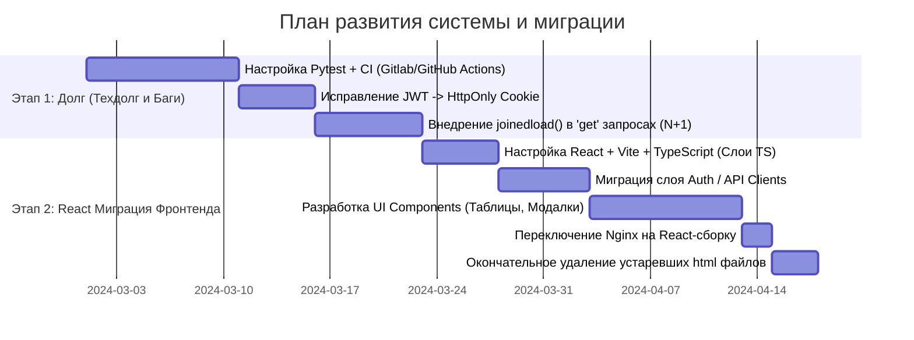

# Архитектура Проекта: Учебная CRM Система

Этот документ представляет собой полное руководство по архитектуре, устройству и процессам внутри нашего веб-приложения. Оно предназначено как для новых разработчиков (чтобы быстро влиться в проект), так и для текущей команды в качестве архитектурного эталона.

---

## 1. 🗺️ PROJECT OVERVIEW (Обзор проекта)

Наша CRM система — это полностековое (full-stack) веб-приложение для управления клиентами, сделками, задачами и взаимодействиями с клиентами. 

**Какую проблему решает проект?** 
Исторически отделы продаж могут использовать Excel или бумажные блокноты, что ведет к потере данных, рассинхронизации между сотрудниками и невозможности аналитики. Наша система переносит эти данные в централизованное безопасное хранилище (PostgreSQL реляционная база данных) со строгими правилами доступа (авторизация по токенам) и удобным графическим интерфейсом.

**Зачем выбраны именно эти технологии?** 
Бэкенд базируется на связке современного асинхронного стека Python: **FastAPI** для высочайшей производительности и типизированного I/O, **SQLAlchemy 2.0** (ORM) для безопасного и объектно-ориентированного доступа к БД, и **Alembic** для версионирования схемы БД. Фронтенд на текущем этапе сознательно написан на **чистом (Vanilla) JavaScript** в целях изучения "голого" DOM API и работы протоколов HTTP/REST до использования высокоуровневых фреймворков.

В ближайшем будущем (см. Раздел 11) запланирована миграция клиентской части приложения на **React**.

---

## 2. 🏗️ ARCHITECTURE DIAGRAM (Архитектурная схема)

Система построена по микросервисной архитектуре (в контексте разделения ответственности на уровне контейнеров) и использует слоистую (n-tier) архитектуру внутри бэкенда.

```mermaid
graph TD
  Browser(Браузер / Клиент) -->|HTTP Requests| Nginx
  
  subgraph Docker Compose Окружение
    Nginx -->|Рассматривает URL| RouterCheck{Начинается на /api?}
    
    RouterCheck -->|Нет: Раздает статику| Frontend(Vanilla JS / HTML / CSS)
    RouterCheck -->|Да: Проксирует| Backend(FastAPI via Uvicorn)
    
    subgraph FastAPI Application
      Backend --> HttpLayer[Routers: Прием запроса / Валидация Pydantic]
      HttpLayer --> BusinessLayer[Services: Бизнес-логика / Проверки прав]
      BusinessLayer --> DataAccessLayer[SQLAlchemy ORM + Схемы моделей]
    end
    
    DataAccessLayer -->|Async SQL (asyncpg)| PostgreSQL[(PostgreSQL Database)]
    Alembic(Alembic Migrations) -.->|DDL команды: ALTER/CREATE| PostgreSQL
    Adminer(Adminer UI) -->|Прямой доступ к БД| PostgreSQL
  end
```

**Решения и механизмы архитектуры:**
- Мы намеренно отделили веб-сервер (Nginx) от приложения (FastAPI/Uvicorn). Зачем? Nginx создан на языке C и невероятно быстр в раздаче статических файлов (картинок, HTML) и обработке сотен тысяч параллельных открытых соединений. Python (Uvicorn) не предназначен для раздачи статики — он должен заниматься только выполнением сложной бизнес-логики.
- Аналогично Nginx выступает как "Reverse Proxy" (Обратный прокси): он закрывает от интернета прямой доступ к внутреннему порту бэкенда (8000), обеспечивая дополнительный уровень безопасности и возможность гибко настроить кэширование / балансировку в будущем.

---

## 3. 📁 PROJECT STRUCTURE — FILE BY FILE (Структура проекта)

Архитектура бэкенда придерживается паттерна **Controller-Service-Repository**, где мы логически разделяем обработку HTTP-протокола, бизнес-логику и работу с БД. Зачем? Чтобы код не превратился в нетестируемое, непереиспользуемое "спагетти".

```text
project/
├── backend/                  # Бэкенд-приложение на Python (FastAPI)
│   ├── app/                  # Исходный код
│   │   ├── alembic/          # Инфраструктура управления БД-миграциями (git для БД)
│   │   │   ├── versions/     # Файлы миграций. Выполняются строго по очереди.
│   │   │   └── env.py        # Файл, соединяющий конфигурацию (config.py) и команду alembic run
│   │   │
│   │   ├── deps/             # Механизм Dependency Injection. Автоматическая пре-обработка
│   │   │   └── auth.py       # Функция проверки JWT-токена в заголовках до того, как код дойдет до руты
│   │   │
│   │   ├── dtos/             # Data Transfer Objects (Слой Валидации DTO / Схемы ввода-вывода)
│   │   │                     # Зачем нужны: Pydantic схемы гарантируют, что клиент не передаст нам 
│   │   │                     # 'int' вместо 'string' или не пришлет SQL-инъекцию в виде спец.символов.
│   │   │   ├── auth.py       # Схемы для входа/регистрации (поля email, password и правила на них)
│   │   │   └── deal.py       # Схемы создания сделки.
│   │   │
│   │   ├── models/           # Слой Данных (Entity) - Классы, зеркалирующие реальную базу данных
│   │   │                     # Зачем нужны: определяют типы PostgreSQL-колонок и связи (ForeignKeys),
│   │   │                     # чтобы SQLAlchemy знал, как конвертировать наши данные в SQL код.
│   │   │   ├── client.py     #
│   │   │   ├── deal.py       #
│   │   │   └── user.py       #
│   │   │
│   │   ├── routes/           # Слой Контроллеров - Отвечают ТОЛЬКО за HTTP (Принять JSON / Отдать HTTP-статус).
│   │   │                     # Зачем нужны: Изолируют HTTP протокол от логики приложения. 
│   │   │                     # Здесь НЕТ логики подсчета налогов сделки или проверки баланса, только вызов сервиса.
│   │   │   ├── auth.py       #
│   │   │   └── deals.py      #
│   │   │
│   │   ├── services/         # Слой Бизнес-Логики (Core) - Здесь живет "мозг" вашей CRM.
│   │   │                     # Зачем нужны: если завтра мы заменим HTTP API на бота Telegram,
│   │   │                     # логика в 'services' останется абсолютно неизменной! 
│   │   │   ├── auth_service.py 
│   │   │   └── deal_service.py 
│   │   │
│   │   ├── utils/            # Изолированные вспомогательные функции (хэширование паролей и т.д.)
│   │   ├── config.py         # Централизованное чтение переменных окружения из контейнера (.env)
│   │   ├── database.py       # Механизм фабрики сессий (async_session_maker) - выдает подключения к БД.
│   │   ├── main.py           # Точка сборки приложения. Регистрирует все роуты, middleware и запускает сервер.
│   │   └── alembic.ini       # Глобальный конфиг Alembic командлайн-тулзы
│   │
│   ├── Dockerfile            # Схема: Как собрать Linux-образ, установить Python и затащить туда наш код.
│   └── requirements.txt      # Фиксация точных версий библиотек (чтобы не сломалось от обновлений).
│
├── frontend/                 # Клиентская часть
│   ├── css/                  # 
│   ├── js/                   # 
│   │   └── api.js            # Зачем нужен: Единая обертка над голым fetch(). Она перехватывает 401 ошибку
│   │                         # для автоматического логаута и сама подставляет Bearer Token из памяти.
│   ├── index.html            # Точка входа в UI (навигация)
│   └── *.html                # Статические разметки страниц (логика рендеринга скрыта в JS файлах)
│
├── nginx/                    # Настройки 웹-сервера Nginx
│   └── nginx.conf            # Механизм реверс-прокси: Разруливает трафик (UI налево, API направо)
└── docker-compose.yml        # Инструмент оркестрации (дирижер). Говорит Dockerу в каком порядке запускать БД, Бэкенд и Nginx
```

---

## 4. 🔄 REQUEST LIFECYCLE DIAGRAM (Жизненный цикл типичного запроса)

Ниже детально расписано, КАК КАЖДЫЙ СЛОЙ обрабатывает создание новой сделки.



---

## 5. 🔧 TECHNOLOGY DEEP-DIVE (Подробный смысл каждого инструмента)

### Docker & Docker Compose
- **Что это:** Программная контейнеризация.
- **ЗАЧЕМ мы это используем (Суть проблемы):** На компьютере Павла стоит Python 3.10 и старый Postgres 12. На компьютере Евелины Python 3.12 и Postgres 16. Из-за этого код Павла не работал у Евелины, и они тратили часы на дебаг. Docker запаковывает *целую операционную систему Linux* (с нужной версией питона) в коробку, и эта коробка запускается идентично на Mac, Windows и Linux-серверах продакшена.
- **Главное для джуна:** Если в `requirements.txt` добавлена новая библиотека (через `pip install`), нужно обязательно пересобрать образ: `docker compose build backend`, иначе образ в контейнере останется старым.

### FastAPI и Dependency Injection (DI)
- **Что это:** Микрофреймворк, строящийся на Starlette (асинхронный сервер) и Pydantic.
- **ЗАЧЕМ мы это используем (Суть механизма):** В старых фреймворках (например Flask) вам нужно вручную брать тело запроса (`request.json()`), вручную парсить его, вручную проверять авторизацию. FastAPI предоставляет систему "Зависимостей" (Depends). Мы пишем: `get_me(current_user: User = Depends(get_current_user))`. Фреймворк *сам* запустит функцию `get_current_user`, *сам* найдет токен в хидерах, и если токен плохой — *сам* вернет ошибку клиенту, даже не пуская запрос в бизнес-код. Это убивает тысячи строк дублирующегося "клейкого" кода авторизации во всем API.

### Pydantic (DTO / Схемы)
- **Что это:** Система строгой типизации и валидации данных.
- **Ошибки джунов:** Джуниоры часто путают **Pydantic-схему** (DTO) и **SQLAlchemy-модель**. 
   - *SQLAlchemy Model:* То, что лежит в БД, содержит служебную метадату, методы ленивой подгрузки (Lazy loading связей). Нельзя просто отправить ее юзеру (сломается сериализация).
   - *Pydantic DTO:* Специально подготовленный слепок (фильтр) данных для юзера. Например, DTO для `User` будет вырезать поле `hashed_password` (чтобы мы случайно не отправили его на фронт), оставляя только `id` и `email`.

### SQLAlchemy (ORM) & Asyncpg
- **Что это:** ORM (Object-Relational Mapping).
- **ЗАЧЕМ мы это используем:** Писать сырой `SELECT * FROM users WHERE id = %s` опасно. Можно ошибиться в синтаксисе, и главное — можно открыть дыру для SQL-Injection (когда хакер вводит в логин `"1 OR 1=1; DROP TABLE users"`). ORM превращает работу с таблицами в работу с объектами (`class User`), полностью параметризует компилируемые запросы (исключая инъекции) и позволяет легко переключаться с PostgreSQL, скажем, на MySQL, если понадобится, без переписывания сотен запросов.
- **Особенность `Asyncpg`:** Мы используем высокопроизводительный *асинхронный* драйвер. В отличие от старого psycopg2 (где код стоит и ждет ответа от СУБД 50 миллисекунд), тут процесс (`await`) отдает ядро процессора другим пользователям API, пока ждет ответ по сети.

### Alembic (Migrations Engine)
- **Что это:** Инструмент DDL миграций.
- **ЗАЧЕМ мы это используем:** БД имеет жесткую структуру колонок. Если завтра тимлид скажет: "Сделкам нужно добавить колонку 'Имя проекта'", вы допишете ее в питоне (`amount = Column...`), но при перезапуске проекта приложение выдаст `Error: column "amount" does not exist`. База данных сама не обновляет свои таблицы. Вы не можете просить каждого разраба зайти в DBeaver и послать DDL-запрос (он может забыть, или ошибиться). Alembic сканирует код Питона, сравнивает с таблицами PostgreSQL, пишет авто-скрипт обновления (`ALTER TABLE ADD COLUMN`) и гарантирует, что эта операция выполнится на базе продакшена, на базе всех 5 разработчиков строго одинаково (Git для SQL-структуры).

### Vanilla JS & Frontend Architecture
- **ЗАЧЕМ мы это используем сейчас:** Для педагогических целей: разработчик должен прочувствовать боль работы с `document.getElementById`, вставкой слушателей `addEventListener`, ручного рендеринга шаблонных строк: `innerHTML = '<div>' + data.name + '</div>'`. 
- **В чем реальная проблема (Почему нужен React):** В текущем варианте:
  1. Вы получили JSON от API.
  2. Вы прошлись циклом и сгенерировали HTML-строку.
  3. Вставили в DOM-дерево.
  4. А если юзер обновил поле локально (ткнул "галочку" на задаче)? Вам придется либо снова запрашивать всё из API и перерисовывать весь список, моргая экраном, либо писать гигантский сложный кусок логики: "найти конкретный div, изменить класс, нарисовать галочку". Приложение становится неуправляемым. Мы теряем синхронизацию между тем, как данные выглядят в JS-Переменной `let tasks = []` и тем, что фактически нарисовано на экране.

---

## 6. 🗄️ DATABASE SCHEMA DIAGRAM (Подробная схема)

Обратите внимание на логику связей. Мы используем отношения "Один ко многим" (1:N).



**Обоснование решения Foreign Keys (Внешние ключи):**
Почему `client_id` это не просто произвольная цифра, а именно `ForeignKey("clients.id")`? 
СУБД выступает финальным гарантом целостности данных (Data Integrity). Если в базу попытаются записать сделку для `client_id = 999` (которого не существует), сама PostgreSQL на уровне ядра прервет транзакцию (Violation Error). Приложение не может положить мусор в БД. Это критически важно.

---

## 7. 🚦 HOW TO RUN THE PROJECT (Быстрый старт)

Для развертывания с нуля:

```bash
# 1. Склонировать проект (подразумевается, что Docker установлен)
git clone <remote-url> 
cd project

# 2. Переменные окружения заранее интегрированы в код для демо-запуска,
# но в реальном мире вы должны создать .env файл:
# cp .env.example .env (Смена логинов/паролей/SECRET_KEY)

# 3. Поднять весь кластер в фоновом режиме (-d = daemon) и пересобрать образ Питона
docker compose up -d --build

# 4. Выполнить начальную миграцию структуры БД внутрь контейнера (накатить таблицы)
docker compose exec backend alembic upgrade head

# 5. Привязанные порты:
#    localhost:80   -> Ваш фронтенд (Nginx -> UI)
#    localhost:80/docs -> Документация API бэкенда (Swagger)
#    localhost:8081 -> Adminer (интерфейс к БД, подключаться по кредам docker-compose.yml)
```

---

## 8. 🔍 ПРОБЛЕМЫ И ТЕХНИЧЕСКИЙ ДОЛГ (Куда расти)

Текущая реализация — MVP (Минимально жизнеспособный продукт) — имеет ряд решений, от которых в enterprise проектах придется отказаться:

1. **Отсутствие тестов (Unit/Integration):** 
   - *Проблема:* Отсутствие папки `/tests` с Pytest. 
   - *Влияние:* Меняя логику `deal_service.py` разработчик может сломать функционал, и он узнает об этом только когда фронтендщик или тестировщик кликнет кнопку в браузере.
   - *Решение:* Внедрить тесты, покрывающие 80% всех сервисов, которые будут запускаться автоматически при git push в ветку `develop` (CI pipeline).

2. **Работа с JWT токенами (Безопасность):**
   - *Проблема:* Скрипт `api.js` сейчас кладет и запрашивает токен авторизации прямо в браузере через скрипт: `localStorage.getItem('token')`.
   - *Влияние:* Если на любой странице сайта случится XSS атака (на сайте выполнится вредоносный JS-код из какого-либо поля от злоумышленника), этот код украдет токен из Local Storage.
   - *Решение:* Настроить бэкенд отдавать токен в виде Cookie с флагами `HttpOnly` (JS не может его прочитать) и `Secure`. Браузер будет сам добавлять его во все HTTP заголовки автоматически (нативно безопасный механизм).

3. **Бизнес-ошибки — нет Transaction Rollback в сложных флоу:**
   - *Проблема:* Если при создании клиента с ним сразу создаются пачка задач в БД, может случиться так, что клиент сохранится (`session.add(client); session.commit()`), а задачи упадут с ошибкой и не сохранятся (возникнет частичное состояние БД). 
   - *Решение:* Использовать атомарные транзакции на слое `Service`. Выполнять `commit()` только когда обе операции добавлены в очередь успешно (Unit of Work паттерн).

4. **N+1 Запросы в SQLAlchemy:**
   - *Проблема:* Если запросить список из 100 сделок (`select(Deal)`), и для каждой фронтенд требует имя создателя (`deal.creator.full_name`), ORM прозрачно и "лениво" (Lazy Loading) сделает еще 100 незаметных SQL-запросов к таблице Users. 1 общий запрос + 100 запросов. База "ляжет".
   - *Решение:* В `deal_service.py` использовать Eager Loading: `select(Deal).options(joinedload(Deal.creator))`. Это заставит Postgres выдать данные одним большим SQL-джоином (`JOIN`).

---

## 9. 🗺️ DEVELOPMENT ROADMAP (Стратегия развития)



**Почему React / TypeScript – наше конечное решение (в разрезе Этапа 2)?**
В Vanilla JS вся бизнес логика приложения смешана с логикой обновления экрана ("найди div, создай p, вставь текст"). React внедряет парадигму **однонаправленного потока данных (One-Way Data Flow)** и концепцию **Виртуального DOM**. Вы просто обновляете JavaScript объект (данные о сделке в стейте `[deals, setDeals]`), и React *сам* высчитывает минимальную разницу (Diffing Algorithm), которую нужно нарисовать на экране. Это позволяет создавать гигантские интерактивные интерфейсы не путаясь в коде. А внедрение типизации ответов сервера прямо на клиенте с помощью **TypeScript** избавит от 90% багов с "undefined object".

---

## 10. 📚 GLOSSARY (Глоссарий для Junior-инженеров)

- **Dependency Injection (DI) в FastAPI:** Паттерн, когда подпрограмме не нужно самой создавать зависимости (парсить токены, подключаться к БД). Фреймворк "впрыскивает" (инжектит) готовые объекты напряму в аргументы функции.
- **ORM (Object-Relational Mapper):** Мост (библиотека), конвертирующая логику Питон объектов (Класс `Client`) в команды SQL понимаемые базой (`SELECT * FROM clients`), абстрагирующая инженера от сырого SQL синтаксиса.
- **DTO (Data Transfer Object) / Схемы Pydantic:** Объект, несущий в себе сырые данные между процессами приложения для гарантии их 100% валидности перед передачей их в бизнес-логику или клиентский UI.
- **Миграция базы (Alembic):** Версионированный Python-скрипт (например: создать колонку, переименовать таблицу), описывающий изменение схемы реляционной базы, чтобы можно было "путешествовать во времени" структуры данных (upgrade/downgrade).
- **Reverse Proxy (Nginx):** "Приемщик" трафика на передней линии проекта. Получает запрос клиента первым, и либо решает отдать статический файл сразу, либо "проксирует" его в бэкенд на сокрытый внутренний порт.
- **JWT (JSON Web Token):** Криптографически подписанный стандартизированный метод представления "удостоверения". Владелец JWT токена передает его серверу с каждым HTTP-запросом. Сервер валидирует его (по `SECRET_KEY`), не храня при этом ни одной записи сессии в своей БД (абсолютно stateless архитектура).
